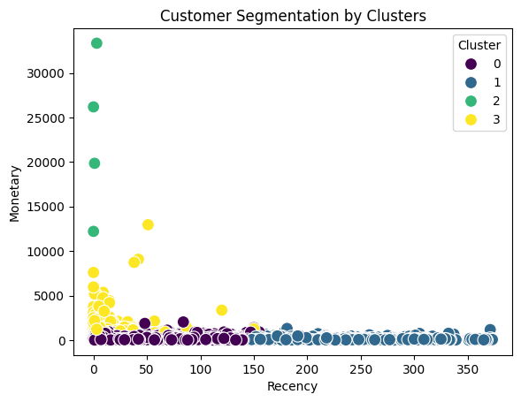
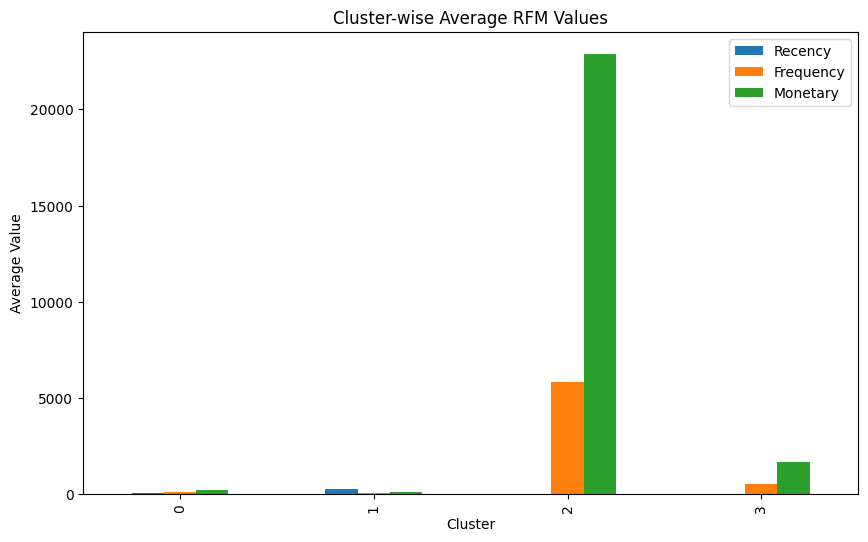
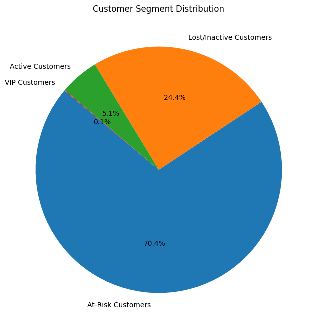

# Customer Segmentation Project

## Project Overview
This project segments customers using RFM (Recency, Frequency, Monetary) analysis and K-Means clustering to identify customer groups and recommend targeted strategies.

## Tools Used
- Python
- Pandas, NumPy
- Scikit-learn
- Matplotlib, Seaborn

## Steps Performed
1. Data Cleaning and Preprocessing
2. RFM Analysis (Recency, Frequency, Monetary metrics)
3. K-Means Clustering
4. Visualization of Clusters
5. Recommendations for Business Strategies

## Results
- **VIP Customers**: Recent, high-spending customers.
- **Active Customers**: Moderately frequent and active buyers.
- **At-Risk Customers**: Infrequent buyers with potential churn risk.
- **Lost Customers**: Inactive customers with minimal purchases.

## Visualizations

## How to Run
1. Install dependencies using `requirements.txt`: